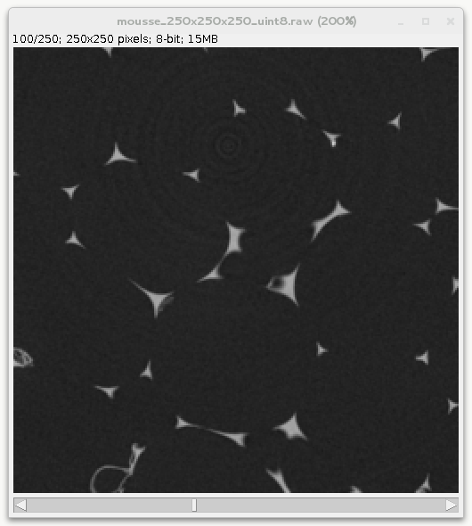

Convention to read and write 2d images with pyplot
--------------------------------------------------

When dealing with 3d images, pymicro uses the following convention:
 * the array in memory represents (x,y,z) data.
 * the data is written to the disk as a succession of (x,y) slices, x being the fastest moving index.

This matches ImageJ convention when looking at the data. For instance
looking at the 100th slice of the foam data set:

When writting 2d images such as tif, jpg or png, out of a numpy array
one may use existing function from matplotlib.pyplot, scipy.misc, etc...
but careful checking needs to be done to remain consistent since pyplot
assume a (y,x) array when plotting, writting, reading images..
This recipe demonstrate how to use the pyplot module to write / read 2d
images. For other format than PNG, pyplot uses PIL under the hood so
this should work with PIL as well.

**Get the complete Python source code:** :download:`convention_read_write_2d_images.py <convention_read_write_2d_images.py>`

In this example we use the foam 3d dataset with size 250x250x250.
First you need to define the path to the 3d volume:

.. literalinclude:: convention_read_write_2d_images.py
   :lines: 5-7

Then load the volume in memory thanks to the `:pymicro:file:file_utils:HST_read` function. The zrange option is used here to load only the 100th slice.

.. literalinclude:: convention_read_write_2d_images.py
   :lines: 9

The slice is saved as a raster image (eg. png or jpg) using pyplot
imsave function:

.. literalinclude:: convention_read_write_2d_images.py
   :lines: 13

The 2d image can now be loaded into memory as a numpy array using pyplot
imread function:

.. literalinclude:: convention_read_write_2d_images.py
   :lines: 16

Note that imsave write png image as 4 RGBA (red, green, blue, alpha)
using floatting point numbers between 0 and 1. Here we have selected
only the first channel (R) since in gray level images R=G=B. To compare
with our initial raw image we may just re-transforming it to 8 bits
(between 0 and 255):

.. literalinclude:: convention_read_write_2d_images.py
   :lines: 17

We can print some of the pixel value to verify the data is well ordered
in memory:

.. literalinclude:: convention_read_write_2d_images.py
   :lines: 19-20

Finally the data is compared using imshow both on the raw data and the
numpy array read from the 2d image and plotting a profile along x:

.. literalinclude:: convention_read_write_2d_images.py
   :lines: 25,28,31-32

.. image:: mousse_250x250x250_uint8_2d_slices.png
   :align: center

Everythings lloks in order, the changes in terms of values along x are
normal since pyplot renormalize the data between 0 and 1 to write the
png image (to minimize the loss of information).

In summary, 3d volumes are handled via (x,y,z) 3d numpy arrays in
pymicro, pyplot assume a (y,x) array when plotting, writting, reading
images. So if you care about having everything consistent you must
transpose the arrays passed to pyplot.
