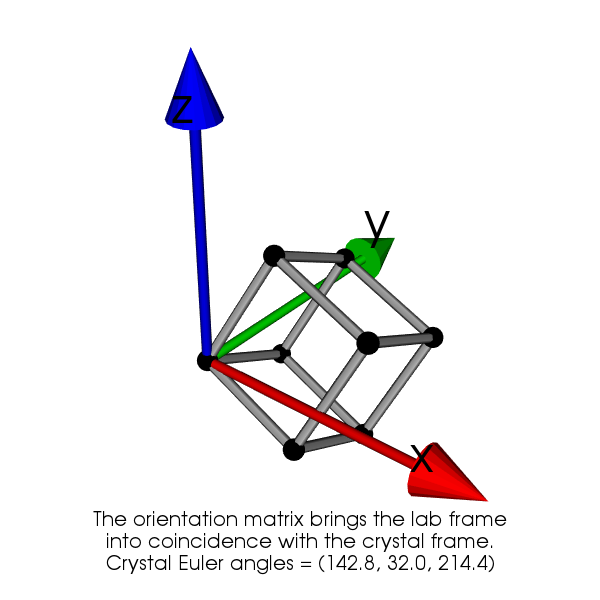
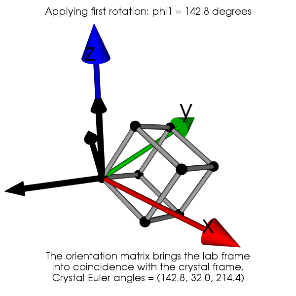
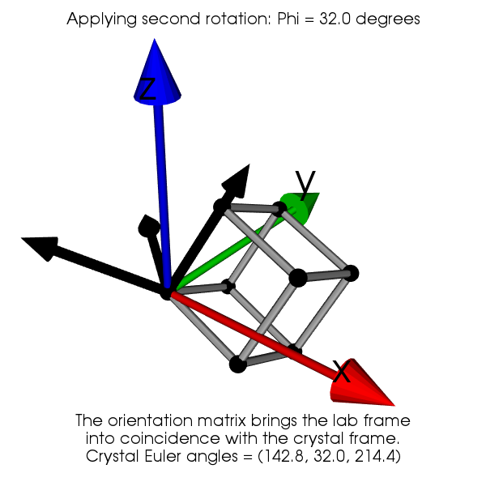
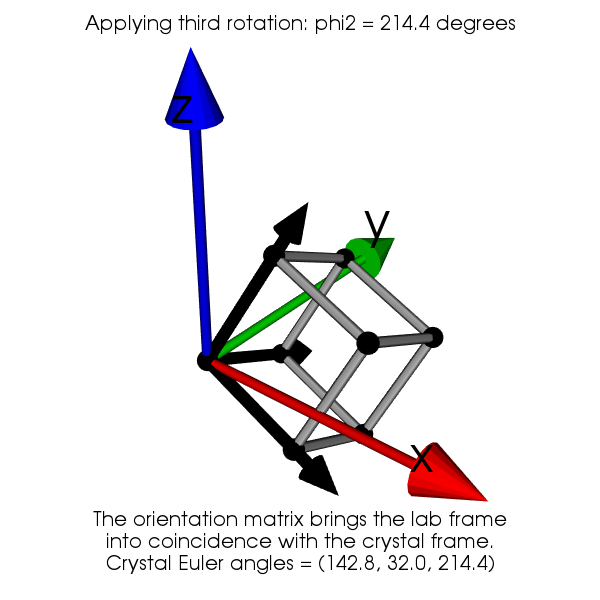
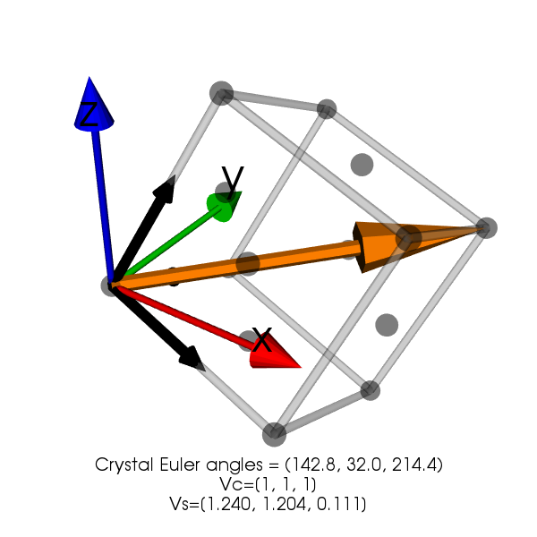

Understanding Euler angles and the orientation matrix
-----------------------------------------------------

In crystallography, the orientation of a lattice can be described with respect to the laboratory frame by a rotation.
In material science, this description follows the passive convention (as used by pymicro) which means the rotation is
defines such as it brings the laboratory frame in coincidence with the crystal frame.

Rotations in Euclidian space have 3 independent components as shown by Euler. They can be described in a number of ways
such as:

 * Euler angles
 * Orientation matrix
 * Rodrigues vector
 * Quaternion

Euler angles are a common way of defining a rotation by combining 3 successive rotations around different axes. Here we
use the convention of Bunge which is to rotate first around Z then around the new X and finally around the new Z. This
example will show how the 3 successive rotations are carried out and that they indeed bring the laboratory frame (XYZ)
in coincidence with the crystal frame.

**Get the complete Python source code:** :download:`euler_angles_anim.py <../examples/animation/euler_angles_anim.py>`

As an example, take the following triplet of Euler angles (in degrees): :math:`(\phi_1, \Phi, \phi_2) = (142.8, 32.0, 214.4)`

.. literalinclude:: ../examples/animation/euler_angles_anim.py
   :lines: 8-10

This instance of `Orientation` can be used to display a crystal lattice in a 3D scene

.. literalinclude:: ../examples/animation/euler_angles_anim.py
   :lines: 7,32-35

   A 3D view of a cubic lattice with a given orientation.

Now by applying successively the 3 rotation, we show that the laboratory frame is made coincident with the crystal
frame. The first rotation of angle :math:`\phi_1` is around Z, the second rotation of angle :math:`\Phi` is around the
new X and the third rotation angle :math:`\phi_2` is around the new Z.

The expression of the orientation matrix is obtained by composing the three rotations :math:`\mathbf{R}_{\phi_1}`,
:math:`\mathbf{R}_{\Phi}` and :math:`\mathbf{R}_{\phi_2}`:

.. math::

   \mathbf{g}(\phi_1,\Phi,\phi_2)=
   \begin{pmatrix}
   \cos\phi_1\cos\phi_2 - \sin\phi_1\sin\phi_2\cos\Phi & \sin\phi_1\cos\phi_2 + \cos\phi_1\sin\phi_2\cos\Phi & \sin\phi_2\sin\Phi \\
   -\cos\phi_1\sin\phi_2 - \sin\phi_1\cos\phi_2\cos\Phi & -\sin\phi_1\sin\phi_2 + \cos\phi_1\cos\phi_2\cos\Phi & \cos\phi_2\sin\Phi \\
   \sin\phi_1\sin\Phi & -\cos\phi_1\sin\Phi & \cos\Phi
   \end{pmatrix}

Using the given Euler angle yield the following orientation matrix:

.. math::

   \mathbf{g}(142.8, 32.0, 214.4)=
   \begin{pmatrix}
    0.946 & -0.117 & -0.299 \\
   -0.026 &  0.898 & -0.437 \\
    0.320 &  0.422 &  0.848
   \end{pmatrix}

With the orientation matrix it is the possible to express any vector :math:`V_c` from the cartesian crystal frame to the sample frame by:

.. math::

   V_s = \mathbf{g}^{-1}.V_c \quad\textrm{with}\quad \mathbf{g}^{-1}=\mathbf{g}^T

From this it follows that the lines of :math:`\mathbf{g}` are actually composed by the 3 cartesian lattice vectors expressed in the lab frame.
Similarly, the columns of  :math:`\mathbf{g}` are composed by the 3 cartesian laboratory vectors expressed in the crystal frame.

For instance, using the same Euler angles and considering the vector :math:`V_c = (1, 0, 0)` gives :math:`V_s=(0.946, -0.117, -0.299)` which is the first line of :math:`\mathbf{g}`.
Chosing :math:`V_c = (1, 1, 1)` gives :math:`V_s=(1.240, 1.203, 0.111)`. This can be verified using pymicro:

.. code-block:: python

  >>> g = orientation.orientation_matrix()
  >>> Vc = np.array([1, 0, 0])
  >>> print(np.dot(g.T, Vc))
  [ 0.94690263, -0.11723012, -0.2993869]
  >>> Vc = np.array([1, 1, 1])
  >>> print(np.dot(g.T, Vc))
  [ 1.24033795  1.20380558  0.11141766]

Finally, looking at the 3d representation for direction :math:`[1, 1, 1]` shows the values seem correct.

   3D view showing the [111] lattice vector in the sample frame XYZ.
