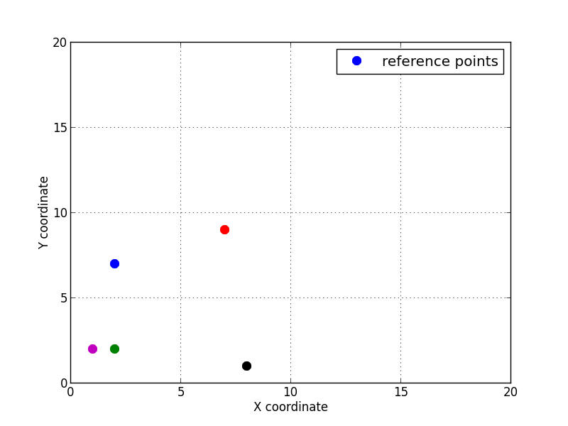
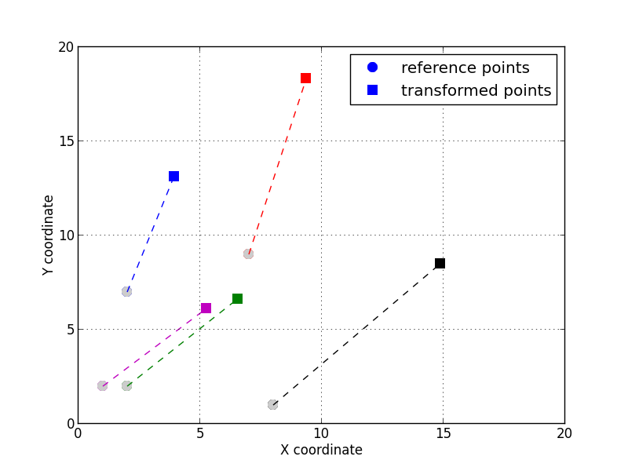
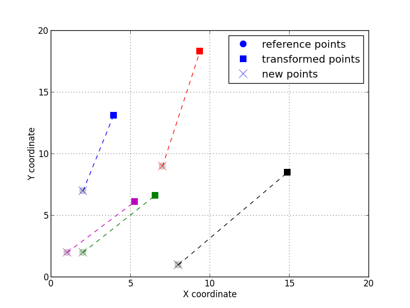

Image alignment by point set registration
-----------------------------------------

It is often the case that images are acquired with different modalities, pehaps different spatial resolutions on the
same specimen and we want to register them together to have a consistent description across all available images.
In this recipe we will see how to achieve that using point set registration between different images.

**Get the complete Python source code:** :download:`pointset_registration.py`

To compute the affine transform between an image and the reference image, at least 3 pair of points must be identified.
The matching pairs are usually obtained by selecting unique features in both images and measuring their coordinates.
Here we will illustrate the method `compute_affine_transform` and then apply it on a real example.

Let's consider 5 points given by their coordinates :math:`(x, y)` in the reference 2D space.

.. literalinclude:: pointset_registration.py
   :lines: 9-14

For the sake of the example, let's transform the 5 points by an isotropic
scaling of :math:`s=1.4`, a rotation of :math:`\theta=22` degrees and a
translation of :math:`(t_x, t_y)=(5, 3)`. The transformation is can be
achieved by multiplying the augmented coordinates vector
:math:`(x, y, 1)^T` by the affine transform matrix
:math:`\mathbf{A}=\mathbf{T}.\mathbf{S}.\mathbf{R}` obtained by the
composition of the rotation, scaling and translation (the order of the
translation is important, here it is applied after the rotation and
scaling).

For this example we have chosen the following transformation:

.. math::

   \begin{pmatrix}
   x' \\
   y' \\
   1
   \end{pmatrix}
   =\mathbf{T}.\mathbf{S}.\mathbf{R}=
   \begin{pmatrix}
   1 & 0 & t_x \\
   0 & 1 & t_y \\
   0 & 0 & 1 \\
   \end{pmatrix}
   \begin{pmatrix}
   s & 0 & 0 \\
   0 & s & 0 \\
   0 & 0 & 1 \\
   \end{pmatrix}
   \begin{pmatrix}
   \cos\theta & -\sin\theta & 0 \\
   \sin\theta & \cos\theta & 0 \\
   0 & 0 & 1 \\
   \end{pmatrix}
   \begin{pmatrix}
   x \\
   y \\
   1
   \end{pmatrix}

.. literalinclude:: pointset_registration.py
   :lines: 25-39

Which is also equivalent to:

.. math::

   \begin{matrix}
   x' = t_x + x s \cos\theta - y s \sin\theta \\
   y' = t_y + x s \sin\theta + y s \cos\theta \\
   \end{matrix}

In this case, one can verify that the full transformation is:

.. math::

   \mathbf{A} = \mathbf{T}.\mathbf{S}.\mathbf{R}=
   \begin{pmatrix}
   1.298 & -0.524 & 5. \\
   0.524 & 1.298 & 3. \\
   0. & 0. & 1. \\
   \end{pmatrix}

With either solution, we can transform the points to obtain the new coordinates:

.. literalinclude:: pointset_registration.py
   :lines: 41-46

With the two lists (or arrays) of points, one can compute the affine transform:

.. literalinclude:: pointset_registration.py
   :lines: 60-63

And register the points using the inverse affine transform and the offset computed from the centroids.

.. literalinclude:: pointset_registration.py
   :lines: 64-68

   The 5 transformed points registered by applying the inverse affine transform.
