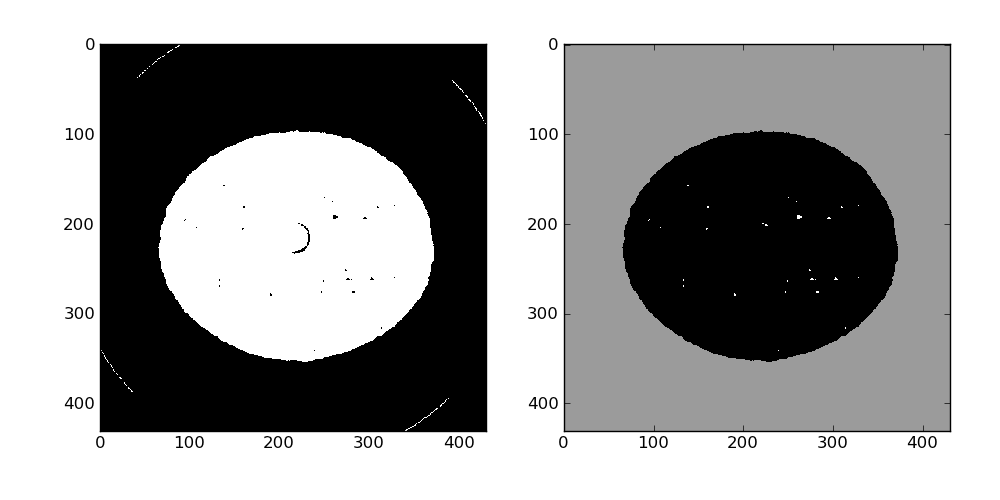

3d analysis and rendering of damage in a steel tension sample
-------------------------------------------------------------

This recipe demonstrate how to analyze the cavities in a steel sample deformed under tension loading.

**Get the complete Python source code:** :download:`steel_damage_analysis.py <steel_damage_analysis.py>`

The 3d data set is a 8 bits binary file with size 341x341x246.
First you need to define the path to the 3d volume:

.. literalinclude:: steel_damage_analysis.py
    :lines: 6-8

Then load the volume in memory thanks to the `:pymicro:file:file_utils:HST_read` function:

.. literalinclude:: steel_damage_analysis.py
    :lines: 11

The reconstructed tomographic volume is not align with the cartesian axes, so rotate the volume by 15 degrees:

.. literalinclude:: steel_damage_analysis.py
   :lines: 16

The result of these operations can be quickly observed using regular pyplot functions such as imshow. Here we look at slice number 87 where a ring artifact is present. We will take care of those later.

.. image:: steel_431x431x246_uint8_data.png
   :align: center

The entire volume is binarized using a simple threshold with the value 100:

.. literalinclude:: steel_damage_analysis.py
   :lines: 23

And cavities are labeled using standard scipy tools:

.. literalinclude:: steel_damage_analysis.py
   :lines: 26

3465 labels have been found, the result can be observed on slice 87 using pyplot:

.. image:: steel_431x431x246_uint8_label.png
   :align: center

We use a simple algorithm to remove ring articfacts (assuming the cavities are convex): the center of mass of each label is compute and if it does not lie inside the label, the corresponding voxels are set to 0. Here 11 rings were removed.

.. literalinclude:: steel_damage_analysis.py
   :lines: 39-52

The outside of the sample needs a little love, it is by far the largest label here so after inverting the labeled image and running a binary closing it can be set to a fixed value (155 here) in the data_bin array.

.. literalinclude:: steel_damage_analysis.py
   :lines: 54-64

At this point the segmented volume can be written to the disk for later use using the `HST_write` function:

.. literalinclude:: steel_damage_analysis.py
   :lines: 76

