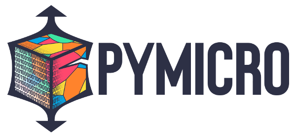

.. pymicro documentation master file, created by sphinx-quickstart on Tue Oct 22 11:17:23 2013.

.. include:: ../README.rst

Introduction
============

pymicro is a python library to load, study and vizualize three dimensional
material data with a particular focus on crystalline microstructures. It
combine the generic power of the main scientific python libraries (namely
numpy, scipy and matplotlib) with the 3D visualisation capabilities of a state
of the art library as VTK. The goal of pymicro is to make it easy (or easier)
to process your 3D datasets especially when it comes to automated processing
needed for in situ data analysis.

Contents:

.. toctree::
   :maxdepth: 2

   welcome
   auto_examples/index.rst
   cookbook
   pymicro
   changelog
   references

Indices and tables
==================

* :ref:`genindex`
* :ref:`modindex`
* :ref:`search`

