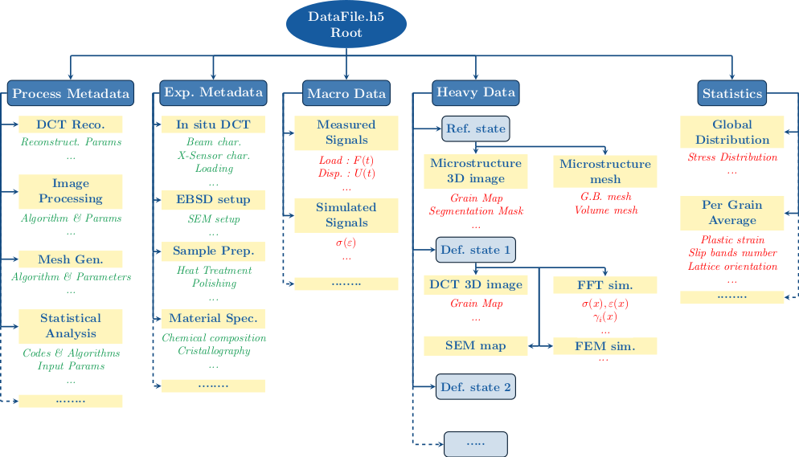

.. _data_management_label:

Scientific Data Management with Pymicro
========================================

One of Pymicro's main goals is to help material scientists to handle the vast 
amount of data of many kinds that is generated during the study of material
samples via various simulation of characterization techniques. To this end, a 
specific data platform has been designed and implemented in the ``pymicro.core``   
package. It provides a **data model**, a **file format**, and an interface to
create, store, and work with material science datasets.

This page presents the different concepts and objects used for data management 
in Pymicro. It is followed by a step-by-step tutorial to master its practical 
use.  

Pymicro's Data Platform
-----------------------

The ``pymicro.core``  module has been designed to be an independent module. Its aim
is to serve as a prototype of what could constitute a generic data platform for 
the material science community. It is centered on a main *class*, the 
``SampleData`` class.

The ``SampleData`` class is designed to handle all data modalities relevant to 
material science, to bring them together and organize them into multimodal 
datasets, and to reduce the technical complexity of data management for the end
user. The class provides two essential features:

1. A file format and a data model for these multimodal datasets
2. A high-level interface to interact with datasets

As its name suggests, it is designed to associate a dataset to each studied 
material sample. Each ``SampleData`` class instance is associated to one dataset 
file in memory. The class methods then provide the interface to interact with 
the data contained in the dataset. The interface enables to:

* Add, remove, and organize data of various types, formats, shapes into the same
  dataset.
* Add, remove and organize light metadata for all elements of a dataset.
* Get simple or detailed information on the dataset content.
* Enable 3D visualization of spatially organized data (images, maps, measured or
  simulated fields).
* Provide efficient and distinct compression options for each element of a 
  dataset.
* Provide a framework to automate interface between the datasets and data 
  processing or numerical simulation tools.
* Provide a framework to derive classes from SampleData that are specialized to 
  a specific type of material samples, such as the ``Microstructure`` class of the
  ``pymicro.crystal.microstructure`` module.  

File format
-----------

HDF5 
^^^^

``SampleData`` associates to each class instance a **HDF5 dataset file**. 
`HDF5 <https://www.hdfgroup.org/solutions/hdf5/>`_ is a library and file format 
that supports an unlimited variety of datatypes, designed to store large data. 
It is a hierarchical format: it allows to gather multiple data and create links
to organize them, creating an internal hierarchy that replicates a file system 
within one single file. It also allows to add text metadata to all data elements
in the file, called *HDF5 attributes*. 

The interface with HDF5 files implemented in ``SampleData`` is built on top of
the `Pytables <https://www.pytables.org/>`_ package, that extends the
HDF5 data model, and efficient data compression and I/O tools.   

XDMF
^^^^

In addition, the ``SampleData`` class can produce an XMDF file, associated to the 
HDF5 dataset. `XDMF <https://www.xdmf.org/index.php/Main_Page>`_ is an extension 
of XML file format that allows to provide a data model for arrays 
representing spatially organized data, *i.e.* 2D or 3D data (fields). 

Practically, it is an XML file containing the description, for each grid 
supporting the fields, of its topology, its geometry and its dimensions. It also
provides the description of the fields defined on the grid (type, dimension), 
and enables to refer to data arrays stored in HDF5 data files to define their 
values. **It can be seen as an light metadata file allowing softwares to 
interpret the raw binary data stored in an HDF5 file**. 

This XDMF/HDF5 file pair is a data format is used by 
data processing or numerical simulation softwares that are widely used by the 
material science community (`Fenics <https://fenicsproject.org/>`_, 
`DAMASK <https://damask.mpie.de/index.html>`_, 
`Dream3D <http://www.dream3d.io/>`_...). HDF5/XDMF file pairs can be loaded by 
the powerfull and popular 3D visualization free software 
`Paraview <https://www.paraview.org/>`_.  **This is a practical way to visualize
2D or 3D data stored into a *Pymicro* HDF5 dataset.**

You will find below an example of a XDMF file associated to a HDF5 file:

.. code-block:: xml 

    <?xml version="1.0" ?>
    <!DOCTYPE Xdmf SYSTEM "Xdmf.dtd" []>
    <Xdmf xmlns:xi="http://www.w3.org/2003/XInclude" Version="2.2">
    <Domain>
        <Grid Name="Particle Images" GridType="Uniform">
            <Topology TopologyType="3DCORECTMesh" Dimensions="400 300 300"/>
            <Geometry GeometryType="ORIGIN_DXDYDZ">
                <DataItem Name="Origin" Dimensions="3" NumberType="Float" Precision="4" Format="XML">
                                0 0 0
                </DataItem>
                <DataItem Name="Spacing" Dimensions="3" NumberType="Float" Precision="4" Format="XML">
                                1 1 1
                </DataItem>
            </Geometry>
            <Attribute Name="second 0" AttributeType="Scalar" Center="Node">
                <DataItem Format="HDF" NumberType="UInt" Precision="2" Dimensions="400 300 300">test.hdf:/images/0/image</DataItem>
            </Attribute>
        </Grid>
    </Domain>
    </Xdmf>

This file pair contains a 3D image (regular grid) of 400x300x300 voxels, that
supports a scalar field ``second 0``, that is stored in the node 
``/images/0/image`` of the HDF5 file ``test.hdf5``. The ``SampleData`` class 
handles the automatic generation of such files to describe the HDF5 datasets, 
and benefit from 3D visualization with Paraview.

Data Model 
----------

``SampleData`` datasets comply with a specific **data model**. A data model is 
the set of convention to store and read data that must be known to make sens out
of it. For instance,  a three dimensional array of floating point vales may be 
the X,Y,Z geometry for a grid or calculated vector values. Without a data model,
it is impossible to tell the difference.

The data model implemented within the ``SampleData`` class provides several 
**data items**, that can be used to store the various types of data that must be
gather into material science datasets. These various items are briefly presented
here. Specific notebooks will follow to  detail the features and interface for 
each of these type of items. 

HDF5 Data Model
^^^^^^^^^^^^^^^

Pymicro's data model is built on top of the HDF5 data model. The latter is based
on the following items:

* **Groups**: a data structure that can be linked to other groups or datasets, 
  and is used to organized data objects. They can been seen as the 'directories'
  of a HDF5 dataset. Every HDF5 file contains a root group that can contain 
  other groups.
* **Data arrays** or **Nodes**: arrays of data that can have different 
  types/shapes, and are attached to a Group.
* **Attributes**: Name/Value pairs just like in a Python dictionary.  Values can
  take any form as long as they remain small (large arrays must not be stored as
  attributes). It is the way to store metadata into HDF5 files. Both Groups and 
  Datasets can hold as many Attributes as required.

Pymicro's Data Model
^^^^^^^^^^^^^^^^^^^^

The ``SampleData`` data model introduces two types of particular HDF5 Groups. 
They are dedicated to the representation of spatially organized data. Such data 
consist in geometrical grids supporting data array representing field values. 
These grids can be regular grids (images), or have more complex topologies
(meshes). Those two situations correspond to the 2 Group types in the data 
model, that are:

* **Image Groups** are HDF5 groups designed to store data describing 2D or 3D 
  images, *i.e.* regular grids supporting scalar or tensorial fields. They are 
  used for instance, to store data coming from SEM/EBSD or X-ray tomography 
  imaging, or FFT-based simulation results. 3 sub-types of image groups are 
  implemented:
    - ``2DImage`` groups: two dimensional images, *i.e.* grids of  
      :math:`(N_x,N_y)` pixels
    - ``3DImage`` groups: three dimensional images, *i.e.* grids of 
       :math:`(N_x,N_y, N_z)` voxels
    - ``emptyImage`` groups: image groups that do not support any data and 
      topology yet
    
* **Mesh Groups** are HDF5 groups designed to store data describing 2D or 3D 
  meshes, *i.e.* grids described by node coordinates and elements connectivities,
  supporting scalar or tensorial fields. They can be used to store data coming 
  from finite element simulations, CAD designs etc... 3 sub-types of mesh groups
  are implemented:
    - ``2DMesh`` groups: two dimensional meshes, *i.e.* grid of nodes defined by
      their :math:`(X_i,Y_i)` coordinate pairs.
    - ``3DMesh`` groups: three dimensional meshes, *i.e.* grid of nodes defined
      by their :math:`(X_i,Y_i,Z_i)` coordinate pairs.
    - ``emptyMesh`` groups: represent mesh groups that do not support any data
      and topology yet.

In addition, the data model introduces two additional types of HDF5 **Nodes**:

* **Structured Tables** are heterogeneous and bidimensional data arrays, *i.e.* 
  that may contain data of different types (integers, floats, strings, sub 
  arrays...) within the same row, all rows having the same format. Each column
  of those arrays can have a specific name. Those arrays are equivalent to 
  `Numpy structured arrays <https://numpy.org/doc/stable/user/basics.rec.html>`_.

* **Fields** are specific data arrays that must belong to a grid group (Image or
  Mesh Group), and whose shape and dimensions must comply with the grid topology.
  They are used to store and manipulate spatially organized arrays, that 
  represent mechanical fields (for instance, displacement or temperature fields,
  microstructure phase maps, EBSD orientation maps....).

Those specific data objects introduced by ``SampleData`` all have a specific data
model, associated metadata, and a specific interface. Each one of them is the
subject of a dedicated Notebook in this User Guide. 

Data Model example
^^^^^^^^^^^^^^^^^^

To illustrate what ``SampleData`` datasets may look like, a virtual example of a
polycrystalline material sample dataset is represented in the schematic diagram
below:

Groups are used to organize data into coherent categories. Metadata are 
represented in green, and datasets in red. As it appears on the diagram, Groups
can be dedicated only to organize metadata, for instance to document material 
nature, composition, elaboration process, or the experimental set-up used for 
imaging and mechanical tests. 

* The *Macro Data*  and *Statistics* Groups will typically contain simple 
  *arrays* datasets or *structured tables*, to store mechanical tests 
  outputs (loading curves) or some statistics on the microstructure geometry or 
  mechanical state. 
  

* The *Heavy Data* group will typically contain the spatially organized data, 
  coming from 3D or 2D in-situ imaging techniques, and simulation softwares. 
  It will most likely contain *Image or Mesh Groups*, and contain *Fields*.
